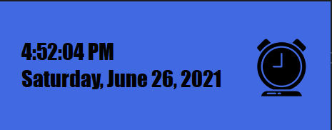

<h1>C# PWF Clock</h1>

<h4>Form1.cs</h4>

  private void Form1_Load(object sender, EventArgs e)
        {
            timer1.Start();
        }

        private void timer1_Tick(object sender, EventArgs e)
        {
            Time.Text = DateTime.Now.ToLongTimeString();
            label1.Text = DateTime.Now.ToLongDateString();
        }

  
